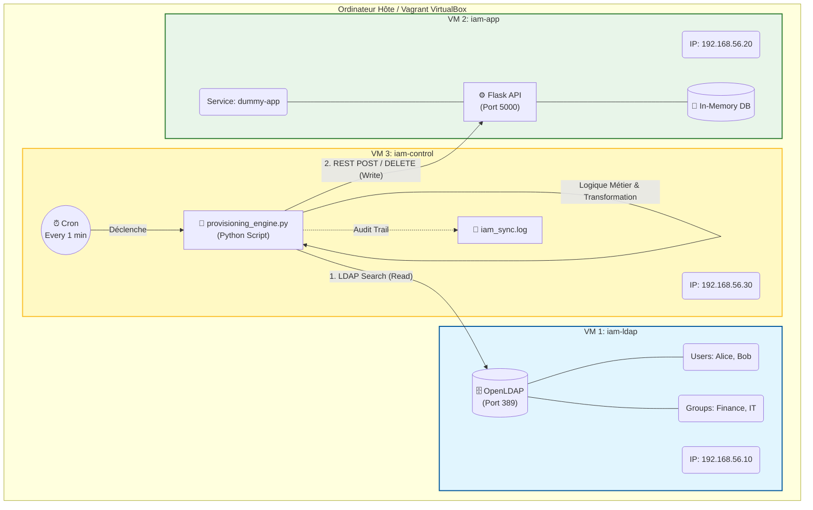

#  IAM Provisioning Lab : Architecture Hybride Automatisée

##  Présentation
Ce projet est un démonstrateur technique (POC) illustrant la gestion du cycle de vie des identités (**Identity Lifecycle Management**) dans un environnement distribué. 

L'objectif est de simuler une chaîne de provisionnement complète : de la source de vérité (HR/Directory) vers une application cible (SaaS), en appliquant des règles de gestion (RBAC) et de nettoyage de données.

##  Architecture
L'infrastructure repose sur 3 machines virtuelles interconnectées via un réseau privé, déployées via **Vagrant** (Infrastructure as Code) :

| Rôle | Serveur | Technologie | Description |
| :--- | :--- | :--- | :--- |
| **Source** | `iam-ldap` | **OpenLDAP** | Simule l'Active Directory (Source of Truth). Contient les identités et groupes. |
| **Cible** | `iam-app` | **Python/Flask** | Simule une application SaaS (Target System) exposant une API REST. |
| **Moteur** | `iam-control`| **Python** | Héberge le moteur de réconciliation et les règles métiers. |

##  Fonctionnalités Démontrées (JML)

### 1. Joiner (Embauche)
* Détection automatique des nouveaux utilisateurs dans l'annuaire LDAP.
* Génération d'identifiants uniques (nettoyage, standardisation).
* Création du compte via API sur l'application cible.

### 2. Mover (Mobilité & RBAC)
* Calcul automatique des rôles applicatifs basé sur l'appartenance aux groupes LDAP.
* *Règle Métier :* Si `MemberOf = Finance` -> `Role = FINANCIAL_CONTROLLER`.

### 3. Leaver (Départ)
* Détection du statut "Inactive" dans la source.
* Déprovisionnement automatique (suppression) du compte sur l'application cible pour garantir la sécurité.

##  Stack Technique
* **Langage :** Python 3.8+
* **Librairies Clés :** `ldap3` (Protocole LDAP), `requests` (API Rest), `logging`.
* **Infrastructure :** Vagrant, VirtualBox, Ubuntu 20.04 LTS.
* **Services :** Systemd (Service Linux), Cron (Planification).

##  Installation & Usage

1. **Déploiement de l'infra :**
   ```bash
   vagrant up
   ```

2. **Connexion au contrôleur**
   ```bash
   vagrant ssh iam-control
   ```

3. **Exécution du moteur de synchronisation**
   ```bash
   python3 provisioning_engine.py
   ```



